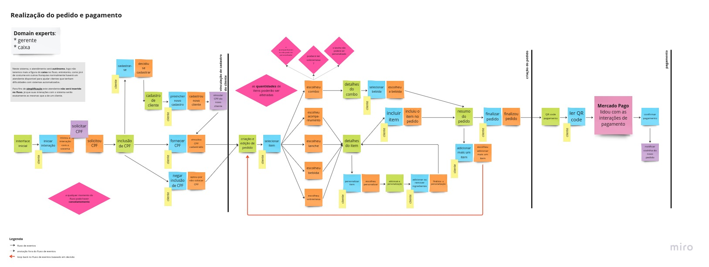
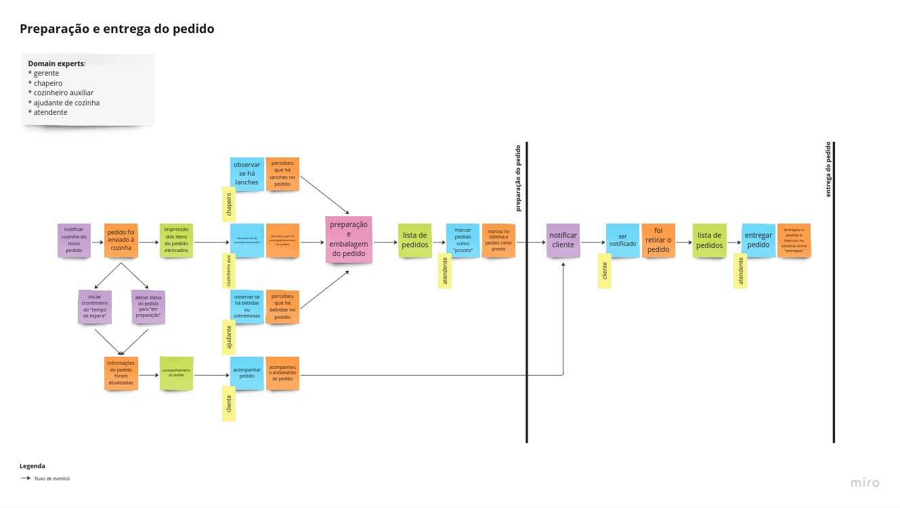
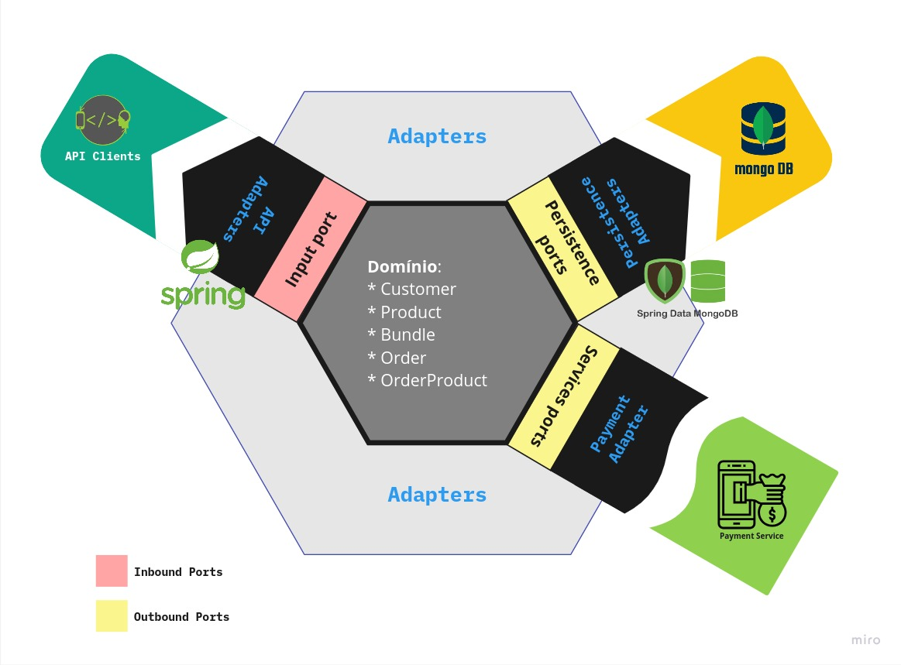

# Tech Challenge - Fase 1

**Índice**

- [Tech Challenge - Fase 1](#tech-challenge---fase-1)
- [Aplicação proposta](#aplicação-proposta)
- [Executando o Projeto Localmente](#executando-o-projeto-localmente)
- [Padrões de Projeto](#padrões-de-projeto)
  - [Nomenclatura](#nomenclatura)
  - [Event Storming](#event-storming)
  - [Arquitetura](#arquitetura)
    - [Domain](#domain)
      - [**Customer**](#customer)
      - [**Product**](#product)
      - [**Bundle**](#bundle)
      - [**OrderProduct**](#orderproduct)
      - [**Order**](#order)
    - [Portas/ Adaptadores](#portas-adaptadores)
      - [Inbound Ports](#inbound-ports)
      - [Outbound Ports](#outbound-ports)
        - [Persistência de Dados](#persistência-de-dados)
        - [Processamento de Pagamentos](#processamento-de-pagamentos)
- [Implementação](#implementação)
  - [Inbound Services](#inbound-services)
    - [REST API](#rest-api)
  - [Outbound Services](#outbound-services)
    - [Persistência de Dados](#persistência-de-dados-1)
    - [Serviço de Pagamentos](#serviço-de-pagamentos)
- [Considerações Finais](#considerações-finais)
- [Dicionário de Linguagem Ubíqua](#dicionário-de-linguagem-ubíqua)

# Aplicação proposta

Implementar uma aplicação de **backend** para **automatizar o processo de pedidos de uma lanchonete**. Para isto deve-se usar a **arquitetura hexagonal** e a implementação deve ser feita em um **monolito**.

A proposta completa do trabalho pode ser encontrada [aqui](PROPOSTA_FASE1.md).

# Executando o Projeto Localmente

O único requisito **obrigatório** para executar este projeto é ter o [Docker](https://www.docker.com) instalado.

No diretório do projeto:
    
```bash

    $ docker-compose up
    
``` 

**URL Padrão da API: http://localhost:8080/api/v1**

É recomendada a utilização do [Insomnia](https://insomnia.rest) para testar a API. A Collection para teste encontra-se no arquivo
`insomnia-collection.json` na raiz do projeto.

# Padrões de Projeto

## Nomenclatura

O código foi implementado seguindo a norma de idioma **inglês** esta decisão foi tomada para evitar confusões causadas
por traduções livres, principalmente de estruturas pertinentes à arquitetura e domínio da aplicação, cuja literatura
encontra-se majoritariamente neste idioma. As traduções dos termos em inglês estão definidos juntamente com o [dicionário
de linguagem ubíqua](#dicionário-de-linguagem-ubíqua).

## Event Storming

A Estratégia de Event Storming foi utilizada para a modelagem do domínio da aplicação.
Foram modelados os fluxos  de [Realização do pedido e pagamento - Figura 1](#figura1) e [Preparação e entrega do pedido - Figura 2](#figura1).

O resultado completo do processo pode ser encontrado no seguinte [quadro no Miro](https://miro.com/app/board/uXjVOvZPCDs=/)




## Arquitetura
Para a implementação do projeto foi escolhido o padrão de arquitetura **Hexagonal** ilustrada na [Figura 3](#figura3).


### Domain
Como mostrado na [Figura 3](#figura3), os domínios da aplicação consistirão em:

#### **Customer**

O cliente cadastrado da lanchonete.

#### **Product**

Domain class: ```Product```

Qualquer **produto** do menu. Produtos podem ser do tipo:

| Tipo de produto | Descrição |
| --- | --- |
| DRINK | Qualquer bebida oferecida na lanchonete |
| SIDE | Qualquer acompanhamento oferecido na lanchonete |
| DESERT | Qualquer sobremesa oferecida na lanchonete |
| SANDWICH | Qualquer lanche oferecido na lanchonete |
| BUNDLE | Qualquer combo oferecido na lanchonete |
| ADDON | Qualquer adicional de qualquer produto |
  
#### **Bundle**

Domain class: ```Bundle```

É um **combo** de produtos cuja venda casada pode gerar um desconto ao consumidor.
Consiste basicamente em um produto que contém uma lista de produtos e um campo "discountPercentage" que armazena a porcentagem de desconto oferecida a quem comprar o combo.

#### **OrderProduct**

Domain class: ```Product```

É um objeto que representa um **produto dentro de um pedido**, ou seja, além do produto possui atributos de quantidade (quantity) e adicionais (addOns) para representar respectivamente quantos produtos do tipo foram incluídos e uma lista com os adicionais selecionados, se houver.

#### **Order**

Domain class: ```Order```

É um **pedido** feito por um cliente cadastrado ou não.
Consiste em uma lista de produtos do tipo ```OrderProduct```, além de um cliente (```Customer```) e dados referentes ao status do pedido (status) e status do pagamento (payment status).

Os possíveis status são:

| Status | Descrição |
| --- | --- |
| PENDING | **Pendente**: um pedido que acabou de ser realizado e ainda está sendo processado |
| COOKING | **Em preparação**: o pagamento já foi aprovado e já está sendo preparado pela cozinha |
| READY | **Pronto**: A cozinha já finalizou o preparo do pedido|
| DELIVERED | **Entregue**: o cliente já retirou o pedido |
| CANCELED | **Pedido cancelado** |

Os possíveis status de **pagamento** são:

| Status | Descrição |
| --- | --- |
| PENDING | **PendPendente**: um pedido que acabou de ser realizado e ainda não teve o pagamento processado |
| APPROVED | **Aprovado**: o serviço de pagamento aprovou o pagamento |
| REJECTED | **Rejeitado**: o serviço de pagamento rejeitou o pagamento, caso isto ocorra o pedido deverá ser cancelado|

### Portas/ Adaptadores

As interações com o *core domain* da aplicação são realizadas utilizando um padrão de **Portas e Adaptadores**, mais conhecido pelo termo em inglês **Ports and Adapters**, que têm como objetivo expor o domínio a possíveis serviços de *inbound* e *outbound* através de interfaces (*ports*).
Assim, é possível padronizar como sistemas externos poderão interagir com o *core business* da aplicação.

#### Inbound Ports

Têm como objetivo expor a interface de serviços oferecidos pela aplicação.
Este tipo de porta, é comumente implementada por sistemas "cliente" que utilizam os serviços oferecidos pelo core da aplicação que devem ser os seguintes:

**Cliente**:

- Criação;
- Edição;
- Obtenção dos dados através do CPF;
- Listar clientes cadastrados.

**Produto**:

- Criação;
- Edição;
- Obtenção dos dados através do ID;
- Obtenção dos tipos de produtos existentes no sistema;
- Listar todos os produtos cadastrados;
- Listar todos os produtos de um tipo específico;
- Exclusão.

**Combo**

- Criação um combo de produtos especificando um desconto atrelado;
- Listar todos os combos;
- Edição;
- Exclusão.

**Pedido**

- Criação;
- Obtenção dos dados através do ID;
- Listar todos os pedidos ativos;
- Listar todos os pedidos ativos de um cliente pelo CPF;
- Atualizar o status do pedido
  - Em preparação
  - Pronto
  - Entregue
  - Cancelado

**Pagamento**

- Realizar pagamento.

#### Outbound Ports

As interfaces de outbound têm como objetivo fornecer capacidades que não são inerentes ao *core business* da aplicação mas que são necessárias para o funcionamento do sistema. Sendo assim, a aplicação *core* pode interagir com determinados serviços sem que particularidades de suas implementação "contaminem" as regras de negócio.

Nesta aplicação, serão necessárias interações com pelo menos dois destes sistemas independentes do *core business*. Um sistema para **persistência dos dados** e um sistema de **processamento de pagamentos**.

##### Persistência de Dados

A interface de persistência de dados deve oferecer os seguintes serviços:

- Salvar (create ou update);
  
**Cliente**:

- Salvar (create ou update);
- Obtenção dos dados através do CPF;
- Listar clientes cadastrados.

**Produto**:

- Salvar (create, update, logical delete);
- Obtenção dos dados através do ID;
- Listar todos os produtos cadastrados;
- Listar todos os produtos de um tipo específico.

**Combo**

- Salvar (create, update, logical delete);
- Listar todos os combos.

**Pedido**

- Salvar (create, update)
- Obtenção dos dados através do ID;
- Listar todos os pedidos ativos;
- Listar todos os pedidos ativos de um cliente pelo CPF.

##### Processamento de Pagamentos

Este serviço irá processar o pagamento e retornar se este foi concluído com sucesso ou não, então a lista de serviços será composta apenas de um serviço:

- Processar pagamento.

# Implementação

Para a implementação deste projeto principais tecnologias utilizadas foram a linguagem [**Java**](https://docs.oracle.com/en/java/javase/17/) e o [**Spring Framework**](https://docs.spring.io/spring-framework/reference/index.html) com [**Spring Boot**]https://spring.io/projects/spring-boot/.

## Inbound Services

### REST API

Como principal forma de interação com o *core business* da aplicação foi criada uma **API REST** com [**Spring Web MVC**](https://docs.spring.io/spring-framework/reference/web/webmvc.html). Esta API comunica-se como o core da aplicação através de adaptadores que implementam os contratos definidos das [portas de inbound](#inbound-service-ports).

## Outbound Services

### Persistência de Dados

Para persistência de dados optou-se por utilizar uma base de dados [**MongoDB**](https://www.mongodb.com/pt-br) integrada através do [**Spring Data MongoDB**](https://spring.io/projects/spring-data-mongodb/).

### Serviço de Pagamentos

Em uma **futura iteração** deste trabalho será implementada uma integração com a [API de pagamentos do Mercado Pago](/www.mercadopago.com.br/developers/pt/reference).
Por enquanto, foi criado apenas um serviço simples que aprova automaticamente o pagamento de todos os pedidos.

# Considerações Finais

A **Arquitetura Hexagonal**, ou **Ports and Adapters Architecture** provê um alto desacoplamento entre as regras do "core" da aplicação e as tecnologias utilizadas para implementar os diferentes serviços.

Durante a implementação desta aplicação isto ficou ao observar que cada serviço utiliza uma tecnologia própria, **desacoplada** do *core business* da aplicação que está **isolado**. Ou seja, serviços que utilizam outras tecnologias poderiam facilmente interagir com a aplicacação *core*, pois para isto basta que implementem adaptadores que respeitem os contratos definidos nas interfaces das portas.

Em contrapartida percebe-se  que o "preço" deste baixo acoplamento é um aumento significativo de verbosidade no projeto devido à necessidade de conversões e mapeamentos entre as classes, aumentando a complexidade e diminuindo a legibilidade do código. Isto se deve também ao fato de a aplicação estar escrita na forma de "*monolito*", fazendo com que tenha muitas responsabilidades centralizadas.
Este problema poderá ser mitigado futuramente dividindo a aplicação em **microsserviços**, assim o uso da arquitetura hexagonal seria mais adequado, pois em serviços atômicos o aumento da complexidade e verbosidade tornam-se menos relevantes, ressaltando a principal vantagem desta arquitetura que é o alto desacoplamento entre as regras de negócio e as tecnologias utilizadas para implementar os serviços oferecidos.


# Dicionário de Linguagem Ubíqua
| Termo (pt-br) como acordado com os domain experts | Termo em inglês (quando presente no sistema) | Definição |
| --- | --- | --- |
| bebida | DRINK | qualquer bebida no cardápio, ex. suco, refrigerante, bebida alcoólica, etc |
| acompanhamento | SIDE | porções que normalmente acompanham os lanches, (ex. batata frita, onion rings) |
| adicionais | ADDON | ingredientes adicionados a itens (ex. dobro de queijo, adicionar mostarda, adicionar calda de chocolate, limão e gelo no refrigerante, etc.) |
| sobremesa | DESERT | qualquer doce do cardápio |
| combo | BUNDLE | uma oferta casada de itens geralmente atrelada a um desconto |
| lanche | SANDWICH | sanduíche presente no cardápio (ex. hambúrguer, queijo quente, X-Tudo) |
| personalização | - | remoção ou adição de ingredientes do lanche via adicionais (ADDON) ou observação (note) |
| itens | items | geralmente refere-se aos itens presentes em um combo ou pedido, resumidamente são produtos do cardápio quando agrupados em um contexto específico. |
| pedido | Order | um ou mais itens selecionados pelo cliente |
| chapeiro | - | pessoa cozinheira responsável pela preparação e montagem de lanches |
| cozinheiro auxiliar | - | pessoa responsável pela preparação e montagem de porções |
| ajudante de cozinha | - | pessoa responsável por embalar e separar pedidos, além de servir bebidas e sobremesas |
| gerente | - | pessoa responsável por coordenar as operações da lanchonete |
| atendente | - | pessoa responsável por atualizar os status de pedido no sistema e interagir com o cliente além de manusear produtos “prontos” como bebidas e sobremesas. |
| cliente | Customer | qualquer pessoa que utilizará o sistema |
| status do pedido | OrderStatus: COOKING, READY, DELIVERED, PENDING, CANCELED. | Status do pedido que poderá ser: “Em preparação”, “Pronto”, “Entregue”, “Pendente”, “Cancelado” |
| status do pagamento | PaymentStatus: PENDING, APPROVED, REJECTED | Status do pagamento que poderá ser: “Pendente”, “Aprovado”, “Rejeitado” |
| produto | Product | qualquer item do cardápio, podendo ser lanche, bebida, acompanhamento, sobremesa, combo ou adicional |