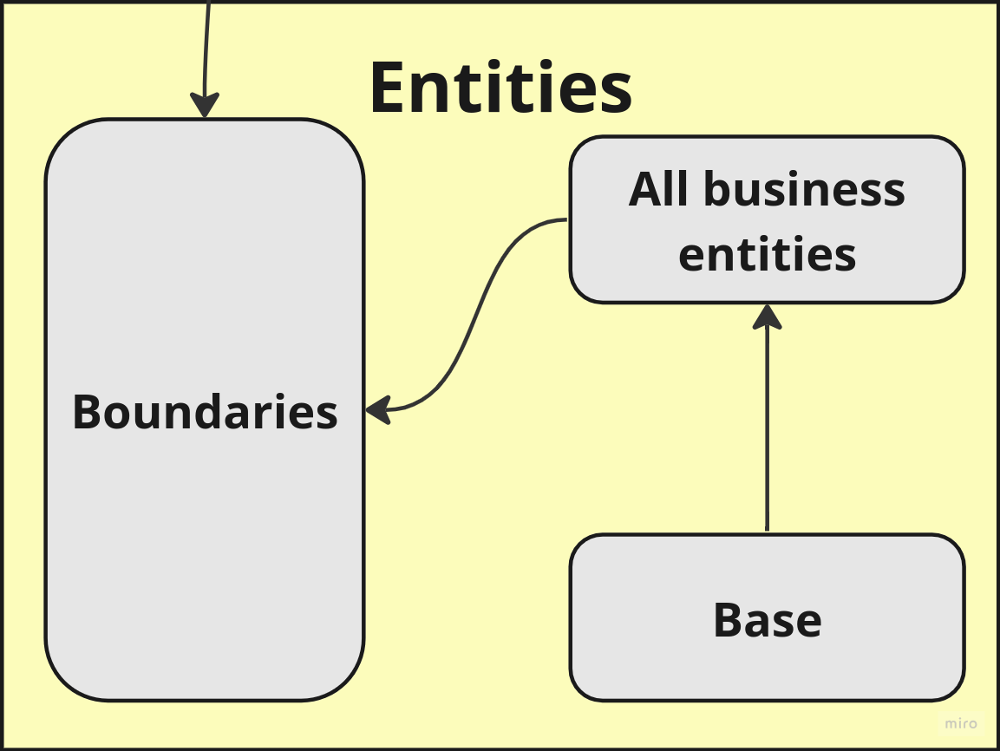
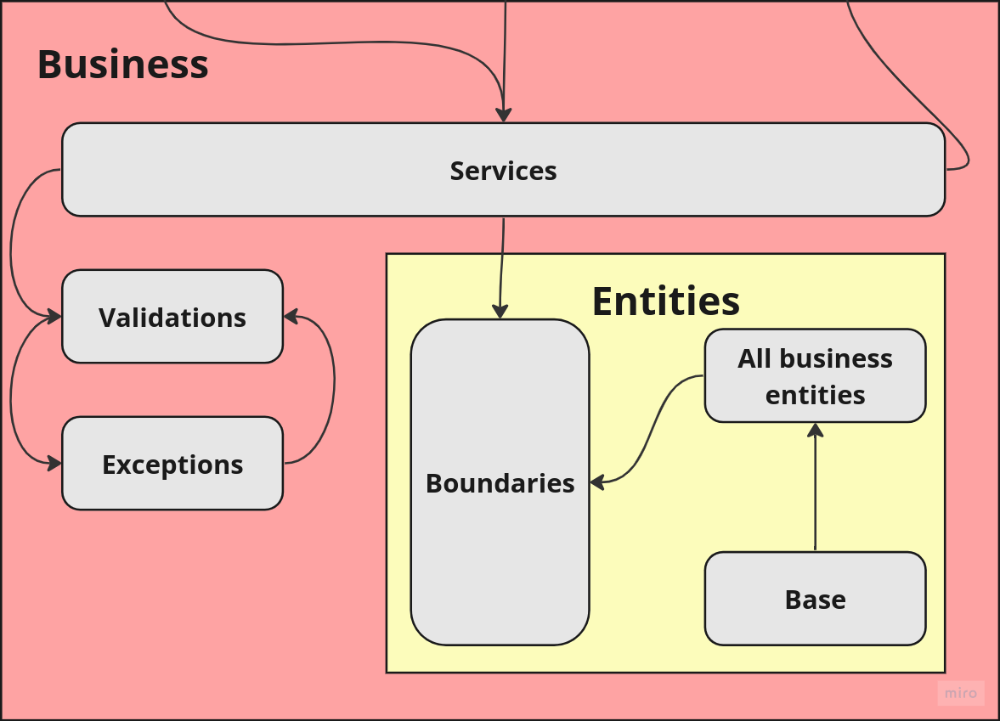
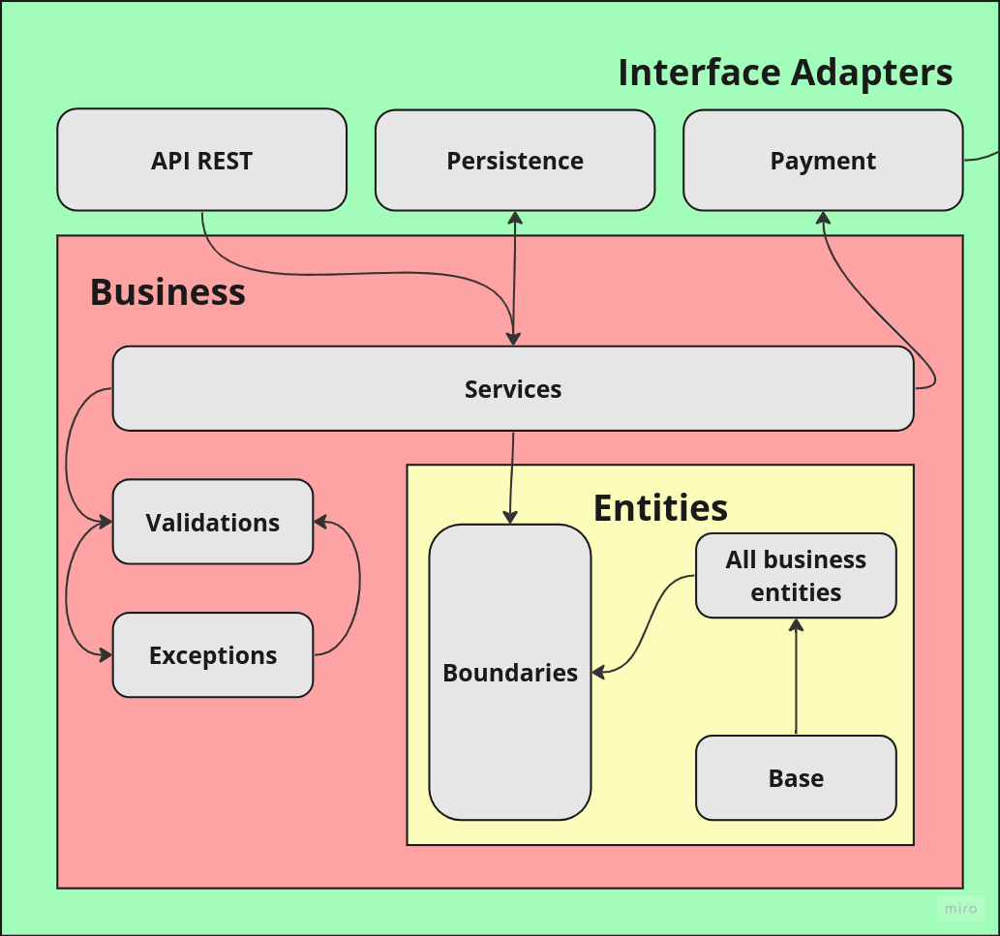
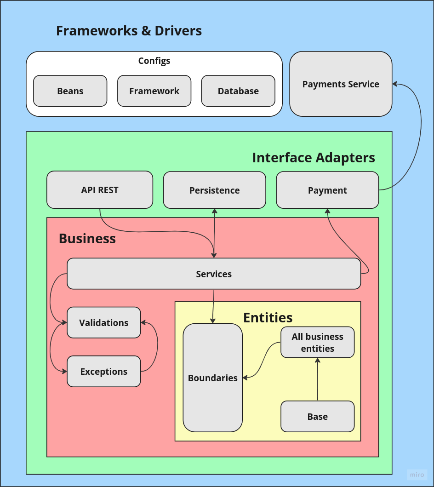

# Tech Challenge - Fase 2

**Índice**

- [Tech Challenge - Fase 2](#tech-challenge---fase-2)
- [Aplicação proposta](#aplicação-proposta)
  - [Entregáveis da Fase 2](#entregáveis-da-fase-2)
    - [Parte 1](#parte-1)
    - [Parte 2](#parte-2)
    - [Parte 3](#parte-3)
  - [Clean Architecture](#clean-architecture)
    - [Entities](#entities)
    - [Business](#business)
    - [Interface Adapters](#interface-adapters)
    - [Frameworks \& Drivers](#frameworks--drivers)
  - [Kubernetes](#kubernetes)

# Aplicação proposta

Implementar uma aplicação de **backend** para **automatizar o processo de pedidos de uma lanchonete**. Para isto deve-se usar a **arquitetura hexagonal** e a implementação deve ser feita em um **monolito**.

A proposta completa do trabalho pode ser encontrada [aqui](PROPOSTA.md).

## Entregáveis da Fase 2

### Parte 1 

Atualizar a aplicação desenvolvida na FASE 1 refatorando o código para seguir os padrões clean code e clean architecture

a. Alterar/criar as APIs:

i. Checkout Pedido que deverá receber os produtos solicitados e retornar a identificação do pedido.

ii. Consultar status pagamento pedido, que informa se o pagamento foi aprovado ou não.

iii. Webhook para receber confirmação de pagamento aprovado ou recusado.

iv. A lista de pedidos deverá retorná-los com suas descrições, ordenados com a seguinte regra:

1. Pronto > Em Preparação > Recebido;

2. Pedidos mais antigos primeiro e mais novos depois;

3. Pedidos com status Finalizado não devem aparecer na lista.

v. Atualizar o status do pedido.

vi. Como desafio extra, opcionalmente, você pode implementar a integração com Mercado Pago para gerar o QRCode para pagamento e integrar com o WebHook para capturar os pagamentos. Caso contrário, será necessário realizar o mock da parte de pagamentos. Como referência, acesse: site do mercado pago.

### Parte 2

Criar uma arquitetura em [**Kubernetes**](https://kubernetes.io) que atenda os seguintes requisitos:

a. Os **requisitos** funcionais descritos na [proposta](PROPOSTA.md). 

b. **Escalabilidade** com aumento e diminuição de Pods conforme demanda.

c. Os [**arquivos manifestos**](/k8s) (yaml) precisam estar no Github junto com a nova versão do código.

### Parte 3

Entrega da seguinte documentação no ReadMe

a. Desenho da arquitetura pensado por você, pessoa arquiteta de software, contemplando:

i. Os requisitos do negócio (problema).

ii. Os requisitos de infraestrutura:

1. Você pode utilizar o MiniKube, Docker Kubernetes, AKS, EKS, GKE ou qualquer nuvem que você desenha.

b. Collection com todas as APIs desenvolvidas com exemplo de requisição (que não seja vazia):

i. Link do Swagger no projeto ou link para download da collection do Postman (JSON).

c. Guia completo com todas as instruções para execução do projeto e a ordem de execução das APIs, caso seja necessário.

d. Link para vídeo demonstrando a arquitetura desenvolvida na nuvem ou localmente

i. O vídeo deve ser postado no Youtube ou Vimeo.

ii. Não esqueça de deixá-lo público ou não listado.

No arquivo entregue na plataforma, é necessário somente colocar a URL do Github com as informações.

## Clean Architecture

Na Fase 2 do Tech Challenge a aplicação foi refatorada para adequar-se aos padrões da [Clean Architecture](https://blog.cleancoder.com/uncle-bob/2012/08/13/the-clean-architecture.html) idealizada por Robert C. Martin, também conhecido como Uncle Bob, e o artigo com a teoria original pode ser encontrado em seu [blog](https://blog.cleancoder.com/uncle-bob/2012/08/13/the-clean-architecture.html) e o diagrama que a representa é o ilustrado a seguir na Figura 1:


### Entities

Percorrendo o diagrama original de dentro para fora, na *Entities* foi definido o escopo de negócios, que referenciando diretamente nossa aplicação Java tratam-se dos pacotes:

- ```businessentities```: Onde estão definidas as entidades de negócio da aplicação, como clientes, produtos e etc. Nestas definições também estão incluídas suas restições de constraints e acesso através da inclusão de *validators* e métodos específicos de cada classe, que propositalmente não possuem "*setters*", o que garante que o controle de estados válidos de cada instância seja feito diretamente na classe.
- ```boundaries```: Onde estão definidos os "contratos" de interação com a aplicação. Isto foi implementado através de *ports* utilizando o recurso de interfaces da linguagem Java. Esta estratégia permite que camadas mais externas interajam de forma controlada com o que tange as *core features* da aplicação.
- ```base```: Este pacote serve como um auxiliar às business entities, pois aqui ficam propriedades e métodos comuns a todas as classes deste escopo.



### Business

Nesta camada ficam pacotes com as implementações relativas aos **Casos de Uso** da aplicação, sendo:

- ```services```: Aqui é onde são implementadas as regras dos **serviços** definidos nas interfaces de ```boundaries```. É pelas services que há as ingrações com as camadas mais exteriores.
- ```validations```: Onde são implementadas as regras de validação já mapeadas em ```boundaries```.
- ```exceptions```: Neste pacote temos todas as possíveis exceções que o sistema pode retornar às camadas externas. estas exceções são sempre baseadas na quebra de regras de negócio ou inconsistência de dados ao construir um objeto.



### Interface Adapters

Aqui é onde ficam as integrações com sistemas "externos" às regras de negócio da aplicação, podendo interagir com as camadas mais internas apenas através dos métodos disponibilizados no pacote de serviços. Para esta fase foram implementados:
  
- ```api```: Uma api REST pela qual pode-se realizar as operações.
- ```persistence```: A implementação das interfaces de persistência de dados.
- ```payment```: Implementação da integração com um serviço de pagamentos, que nesse caso será externo ao sistema.



### Frameworks & Drivers

Por fim temos a camada mais externa da Clean Architecture, onde ficam as definições que utilizam tecnologias não diretamente atreladas às regras de negócio, como databases, webservices UIs e etc.
No contexto da aplicação em questão esta camada dividiu-se entre:
  
- ```configs```: Configurações relativas ao **Spring Framework** e a integração com uma base de dados **MongoDB**.
- ```payment```: Integração com o serviço de pagamentos independente.



## Kubernetes
